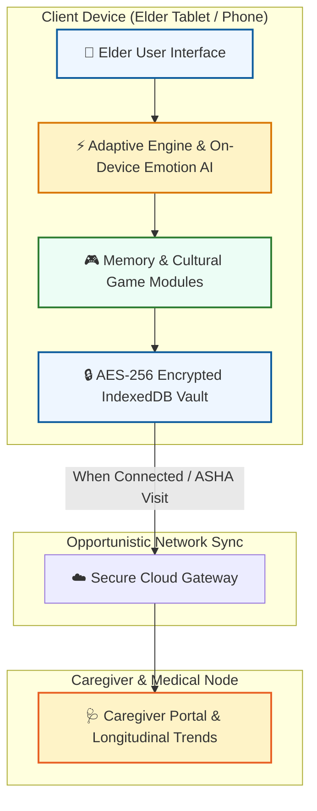

# 🧠 Astraa: AI-Based Cognitive Gaming & Memory Assistance Platform
> **Smart India Hackathon 2026 (SIH 2026)**  
> **Problem Statement ID:** SIH1724  
> **Problem Statement Title:** AI-Based Cognitive Gaming and Memory Assistance Platform for Elderly Dementia Patients  
> **Category:** Software | **Theme:** MedTech / Healthcare AI / Digital Inclusion  
> **Team Name:** Aquaregia (`SIH2026_AQUAREGIA`)

---

## 📌 Executive Summary

**Vanika** is an AI-powered, culturally adaptive cognitive gaming and memory assistance platform designed specifically for elderly dementia patients, with a primary focus on underserved communities in North-East India (NER). 

Equipped with an **On-Device Emotion Engine**, **6 Native Regional Dialects**, **100% Offline-First Architecture**, and **Bank-Grade Data Privacy**, Vanika provides non-stigmatizing daily cognitive stimulation while giving caregivers and healthcare workers actionable longitudinal recovery insights.

---

## ✨ Key Features & Innovation Pillars

### 👵 1. Elder-First Accessibility & UI
- **18px+ Large Typography & High Contrast:** Designed specifically for age-related visual decline.
- **Voice-First Navigation:** Warm, natural voice guidance in regional dialects for elders with low tech literacy.
- **Low-Frustration Gameplay:** Zero penalizing timers or stressful game-over screens.

### 🌾 2. NER Cultural & Memory Engine
- **Culturally Relevant Games:** Enculturated memory activities incorporating regional festivals (Bihu), Majuli river island lore, tea garden walks, and traditional folk wisdom.
- **Personalized Photo-to-Game Engine:** Converts personal family photos, heirlooms, and audio prompts into interactive recall quizzes.

### 🗣️ 3. 6 Regional Language Support
Native voice and text support powered by Gemini AI for:
- 🌾 **Assamese**
- 🏹 **Bodo**
- 🏔️ **Khasi**
- 🌿 **Mizo**
- 📜 **Nagamese**
- 🌐 **English**

### 🧠 4. On-Device Visual & Motion Engagement Engine
- Analyzes spatial motion differential, head stability, and vocal sentiment strictly on-device in real time without sending camera streams to external servers.
- Automatically adjusts game difficulty and eases cognitive tasks when hesitation or restlessness is observed.

### 🔒 5. 100% Offline-First & DPDP Act 2023 Compliant
- Complete local storage powered by IndexedDB & LocalStorage with **real AES-256 symmetric encryption** (`crypto-js`).
- **Zero Cloud Camera Telemetry:** Camera canvas frames and personal family photos never leave the local client device.
- **Opportunistic Background Sync:** Automatically queues caregiver trends offline (<15 KB payload) and syncs safely when ASHA workers or network connectivity returns.

### 🩺 6. Caregiver & Clinician Portal
- 7-day and 30-day cognitive performance trend visualization (Memory score, Attention, Reaction speed).
- Early alert notifications for sudden cognitive dips or emotional distress patterns.

### 🌿 7. 5-Step Personalized Onboarding & Care Calibration
- **Dual-Role Setup:** Caregivers / ASHA workers configure clinical baseline and statutory consents; elders complete a frictionless 3-question voice check.
- **Auto-Calibrated Accessibility:** Sensory adaptations auto-tune 20px+ typography, contrast, and voice speed.
- **Engagement Continuation Lifecycle:** Configurable 7-day trial, structured 8-week program, or ongoing care with periodic check-in nudges.

### 📚 8. Clinical Evidence & Feasibility Grounding
- Grounded in Cochrane Systematic Review on **Reminiscence Therapy** (*Woods et al., 2018*) and **WHO Dementia Guidelines (2019)**.
- Designed for low-cost Android tablets (< ₹8,000 INR) with bandwidth budget < 15 KB/week for rural North-Eastern deployments.
- Detailed clinical citations and pilot deployment plan available in [CLINICAL_GROUNDING_AND_FEASIBILITY.md](./CLINICAL_GROUNDING_AND_FEASIBILITY.md).

---

## 🛠️ Technology Stack

| Layer | Technology | Purpose |
| :--- | :--- | :--- |
| **Frontend Framework** | **React 19 + TypeScript** | Component-driven, resilient client application |
| **Build Tooling & Styling** | **Vite + Tailwind CSS v4** | Ultra-fast build times, accessible design system |
| **AI & LLM Services** | **Google Gemini 2.5 API** | Dialect translation & conversational memory prompts |
| **Icons & Micro-Interactions** | **Lucide React + Motion** | Intuitive visual cues & gentle animations |
| **Data Visualization** | **Recharts** | Caregiver cognitive trend charts & analytics |
| **Local Storage & Vault** | **IndexedDB + LocalStorage** | 100% offline data vault with AES-256 encryption |
| **Backend & Server** | **Node.js + Express + TSX** | Development server & opportunistic sync handlers |

---

## 🏗️ System Architecture & Feasibility Flow



---

## 🚀 Quickstart & Local Setup

### Prerequisites
- **Node.js**: v18.x or higher
- **npm** or **bun**

### Installation

1. **Clone the Repository:**
   ```bash
   git clone https://github.com/aquaregia3213/sih26.git
   cd sih26
   ```

2. **Install Dependencies:**
   ```bash
   npm install
   ```

3. **Configure Environment Variables:**
   Create a `.env` file in the root directory (or copy `.env.example`):
   ```env
   GEMINI_API_KEY=your_gemini_api_key_here
   PORT=3000
   ```

4. **Run the Development Server:**
   ```bash
   npm run dev
   ```

5. **Access the Application:**
   Open your browser and navigate to `http://localhost:3000`.

---

## 🌐 Render Deployment Quickstart

This application is ready to deploy on **Render.com**:

1. Log in to [Render Dashboard](https://dashboard.render.com/).
2. Click **New +** -> **Web Service**.
3. Select your GitHub repository **`aquaregia3213/sih26`**.
4. Settings are automatically populated from [`render.yaml`](./render.yaml):
   - **Build Command:** `npm install && npm run build`
   - **Start Command:** `npm start`
5. Add your Environment Variable:
   - `GEMINI_API_KEY`: *(Your Gemini API key)*
6. Click **Deploy**.

---

## 📁 Repository Structure

```text
SIH/
├── public/                 # Static assets, logos & sound prompts
├── src/
│   ├── components/
│   │   ├── care/           # Caregiver portal & trend charts
│   │   ├── common/         # Modals, accessibility toggles & navigation
│   │   ├── companion/      # Voice assistant & memory companion
│   │   ├── games/          # Cognitive & cultural game engines
│   │   └── patient/        # Patient app views & digital courtyard
│   ├── types.ts            # TypeScript interfaces & domain models
│   ├── utils/              # AI service, storage vault & translation utilities
│   ├── App.tsx             # Main routing & application container
│   └── main.tsx            # Application entry point
├── scripts/
│   ├── generate_ppt.py     # Automated presentation slide generator
│   └── convert_to_pdf.py   # PDF export utilities
├── CLINICAL_GROUNDING_AND_FEASIBILITY.md  # Clinical literature, WHO citations & ASHA feasibility
├── onboarding-prerequisites.md          # Onboarding data model & continuation architecture
├── render.yaml             # Render 1-click deployment configuration
├── server.ts               # Express production server
├── package.json            # Dependencies & script definitions
└── README.md               # Project documentation
```

---

## 📜 Compliance & Security

- **DPDP Act 2023 Compliant:** Full compliance with India's Digital Personal Data Protection Act.
- **Zero Camera Telemetry:** All computer vision and facial emotion analysis run locally in-browser; raw video streams are never transmitted or stored.
- **Encrypted Local Storage:** Patient profiles and game scores are encrypted using AES-256 before being stored in IndexedDB.

---

## 👥 Team Astraa2.0 (SIH 2026)

* **Project:** Astraa Cognitive Platform
* **Problem Statement:** SIH1724
* **Submitted to:** Smart India Hackathon 2026

*Built with ❤️ for digital health inclusion and elderly cognitive care in North-East India.*
